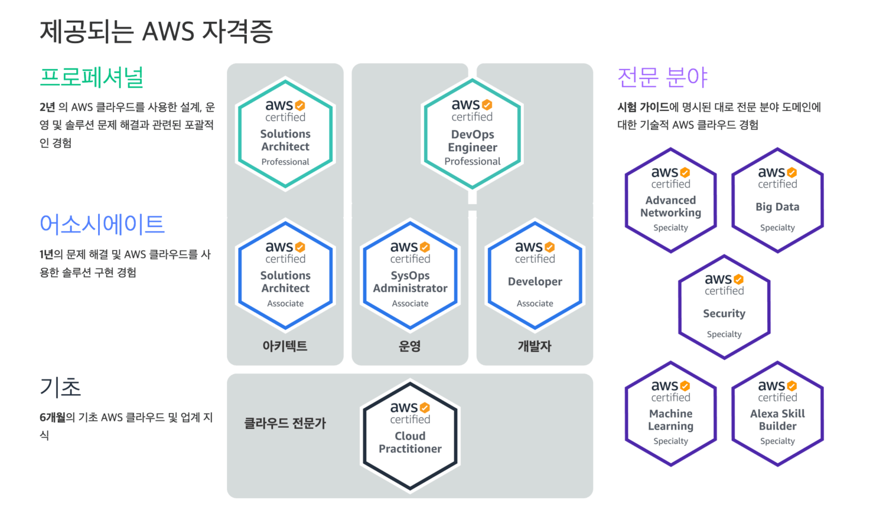

|Title|Date|Check|
|-----|-----|-----|
|AWS Certified Alexa Skill Builder - Specialty|||
|AWS Certified Big Data - Specialty|||
|AWS Certified Cloud Practitioner|||
|AWS Certified Data Analytics - Specialty|||
|AWS Certified Database - Specialty|||
|AWS Certified Developer Associate|||
|AWS Certified Machine Learning - Specialty|||
|AWS Certified Security - Specialty|||
|AWS Certified Solutions Architect - Associate |||
|AWS Certified Solutions Architect - Professional|||
|AWS Certified SysOps Administrator - Associate|||
|AWS DevOps Engineer Professional|||

---

### 

|Level|Code|Title|Date|Check|
|-----|-----|-----|-----|-----|
|100|BES|Business-Essential|||
|AWS Certified Big Data - Specialty|||
|AWS Certified Cloud Practitioner|||
|AWS Certified Data Analytics - Specialty|||
|AWS Certified Database - Specialty|||
|AWS Certified Developer Associate|||
|AWS Certified Machine Learning - Specialty|||
|AWS Certified Security - Specialty|||
|AWS Certified Solutions Architect - Associate |||
|AWS Certified Solutions Architect - Professional|||
|AWS Certified SysOps Administrator - Associate|||
|AWS DevOps Engineer Professional|||

100-ACPEXX-AWS Cloud Practitioner Essentials
2022-01-04  오후 03:49    <DIR>          100-BES-Business-Essential
2022-01-04  오후 03:49    <DIR>          100-CECEBL-AWS Cloud Essential for Business Leaders
2022-01-04  오후 03:49    <DIR>          100-CECEFS-AWS Cloud Essential for Business Leaders-- Financial Services
2022-01-18  오전 11:14    <DIR>          100-MSMEDM-Media-Essentials-for-IT-Business-Decision-Makers
2021-12-29  오전 11:34    <DIR>          100-TECESS-Technical-Essential
2022-01-04  오후 03:50    <DIR>          200-ANBDLK-Building-Data-Lakes-on-AWS
2022-03-21  오후 04:00    <DIR>          200-ARCHIT-Architecting-on-AWS
2021-12-29  오전 11:34    <DIR>          200-BIGDAT-Big-Data-on-AWS
2022-01-04  오후 03:50    <DIR>          200-BSD-2X-KO-PPT-EV
2021-12-29  오전 11:34    <DIR>          200-COREKS-Running-Containers-on-Amazon-Elastic-Kubernetes-Service
2022-01-18  오전 11:14    <DIR>          200-CSAWAF-Well-Architected-Best-Practices
2022-01-04  오후 03:49    <DIR>          200-DAREDS-Building-Data-Analytics-Solutions-Using-Amazon-Redshift
2022-01-04  오후 03:50    <DIR>          200-DBDBAW-Planning-and-Designing-Databases-on-AWS
2022-01-04  오후 03:50    <DIR>          200-DBDWOA-Data-Warehousing-on-AWS
2022-02-21  오후 03:53    <DIR>          200-DEVOPS-DevOps-Engineering
2022-03-24  오후 10:47    <DIR>          200-DODEVA-Developing-on-AWS
2022-01-04  오후 03:49    <DIR>          200-MLDEEP-Deep-Learning-on-AWS
2022-01-04  오후 03:49    <DIR>          200-MLDWTS-The-Machine-Learning-Pipeline-on-AWS
2022-02-21  오후 03:53    <DIR>          200-MLPDSS-Practical-Data-Science-with-Amazon-SageMaker
2021-12-29  오전 11:34    <DIR>          200-MLPOPS-MLOps-Engineering-on-AWS
2021-12-29  오전 11:36    <DIR>          200-MSVSES-Video Streaming Essentials for-AWS Media Services
2021-12-30  오전 11:43    <DIR>          200-SISECO-Security-Engineering-on-AWS
2021-12-29  오전 11:36    <DIR>          200-SISGOV-Security-Governance
2021-11-16  오전 11:22    <DIR>          200-STSCTR-20-KO-IG-PPT
2022-01-04  오후 03:50    <DIR>          200-SVDVSS-Developing-Serverless-Solutions-on-AWS
2022-01-04  오후 03:49    <DIR>          200-SYSOPS-Systems-Operations-on-AWS
2021-12-30  오후 01:37    <DIR>          300-ACARCH-Architecting-On-AWS-Accelerator
2021-12-30  오후 01:31    <DIR>          300-ADVARC-Advanced-Architecting-on-AWS
2021-12-30  오후 01:35    <DIR>          300-ADVDEV-Advanced-Developing-on-AWS
2021-12-30  오후 01:25    <DIR>          300-CORCEM-33-KO-IG-PPTX