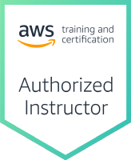
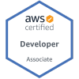

---

| Title                                            | Date          | Status  | V.R | Expire     |
| ------------------------------------------------ | ------------- | ------- | --- | ---------- |
| AWS Certified Cloud Practitioner                 |               |         |     |            |
| AWS Certified Data Engineer - Associate          |               |         |     |            |
| AWS Certified Developer Associate                | 2020-03-03    | Active  |     | 2026-08-04 |
| AWS Certified Machine Engineer - Associate       |               |         |     |            |
| AWS Certified Machine Learning - Specialty       | 2023-02-28    | Active  | O   | 2026-02-28 |
| AWS Certified Advanced Networking - Specialty    |               |         |     |            |
| AWS Certified Security - Specialty               | 2024-01-19    | Active  | O   | 2027-01-19 |
| AWS Certified Solutions Architect - Associate    | 2019-10-29    | Active  |     | 2028-09-01 |
| AWS Certified Solutions Architect - Professional | 2023-09-03    | Active  | O   | 2028-09-01 |
| AWS Certified SysOps Administrator - Associate   | 2020-08-18    | DevOps  |     | 2026-08-04 |
| AWS DevOps Engineer Professional                 | 2020-08-18    | Active  |     | 2026-08-04 |
| ~~AWS Certified Big Data - Specialty~~           | ~~2020-05-15~~| Expired |     | 2023-05-15 |
| ~~AWS Certified Data Analytics - Specialty~~     |               |         | O   |            |
| ~~AWS Certified Database - Specialty~~           |               |         |     |            |

---

###

| Level | Code   | Title                                                   | Version | Ko.Ver | Check |
| ----- | ------ | ------------------------------------------------------- | ------- | ------ | ----- |
| 100   | 초급    |                                                         |         |        |       |
| 100   | BES    | Business-Essential                                      |         |        |       |
| 100   | TECESS | Technical-Essential                                     |         |        |       |
| 200   | 중급    |                                                         |         |        |       |
| 200   | ANBDLK | Building-Data-Lakes-on-AWS                              |         |        |       |
| 200   | ARCHIT | Architecting-on-AWS                                     |         |        |       |
| 200   | BIGDAT | Big-Data-on-AWS                                         |         |        |       |
| 200   | COREKS | Running-Containers-on-Amazon-Elastic-Kubernetes-Service |         |        |       |
| 200   | CSAWAF | Well-Architected-Best-Practices                         |         |        |       |
| 200   | DAREDS | Building-Data-Analytics-Solutions-Using-Amazon-Redshift |         |        |       |
| 200   | DBDBAW | Planning-and-Designing-Databases-on-AWS                 |         |        |       |
| 200   | DBDWOA | Data-Warehousing-on-AWS                                 |         |        |       |
| 200   | DEVOPS | DevOps-Engineering                                      |         |        |       |
| 200   | DODEVA | Developing-on-AWS                                       |         |        |       |
| 200   | MLDEEP | Deep-Learning-on-AWS                                    |         |        |       |
| 200   | MLDWTS | The-Machine-Learning-Pipeline-on-AWS                    |         |        |       |
| 200   | MLPDSS | Practical-Data-Science-with-Amazon-SageMaker            |         |        |       |
| 200   | MLPOPS | MLOps-Engineering-on-AWS                                |         |        |       |
| 200   | MSVSES | Video Streaming Essentials for-AWS Media Services       |         |        |       |
| 200   | SISECO | Security-Engineering-on-AWS                             |         |        |       |
| 200   | SISGOV | Security-Governance                                     |         |        |       |
| 200   | SVDVSS | Developing-Serverless-Solutions-on-AWS                  |         |        |       |
| 200   | SYSOPS | Systems-Operations-on-AWS                               |         |        |       |
| 300   | 고급    |                                                         |         |        |       |
| 300   | ACARCH | Architecting-On-AWS-Accelerator                         |         |        |       |
| 300   | ADVARC | Advanced-Architecting-on-AWS                            |         |        |       |
| 300   | ADVDEV | Advanced-Developing-on-AWS                              |         |        |       |
| 300   | CORCEM |                                                         |         |        |       |
| 300   | DAQSAU | Authoring Visual Analytics Using Amazon QuickSight      | 1.3.2   | NA     |       |
| 300   | MLASMS | Amazon SageMaker Studio for Data Scientists             |         |        |       |
| 300   | MLDGAI | Developing Generative AI Applications on AWS            | 1.0.0   | O      |       |

---

### AWS Certification Roadmap

---

### Digital Instuctor Enablement

|Title                                             |   |
|--------------------------------------------------|---|
|Building Agentic AI with Amazon Bedrock AgentCore |   |

---

[Link](https://us-east-1.instructor.classrooms.aws.training/classes)